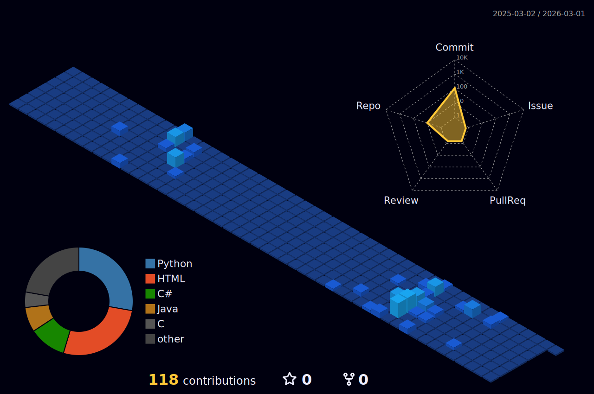

# Hi there, I'm Muhammad Muneeb! 

- 🎓 I'm a 3rd Year *BSCS* student at [SZABIST](https://www.szabist.edu.pk/)
- 🧠 President of **ACM SZABIST**, building tech communities & cool dev cultures
- 🚀 Full-stack & .NET dev who also dabbles in DevOps, cloud & mapping tech  
- ⚡ Fun fact: I break stuff just to fix it better… and yes, I can solve a Rubik’s Cube under 2 minutes 😌

---

## Find me on:

---

## Tech I have worked with:

### **Languages**

---

### **Frameworks / Libraries**

---

### **Databases**

---

### **Tools & Platforms**

---

 

      
    
    

